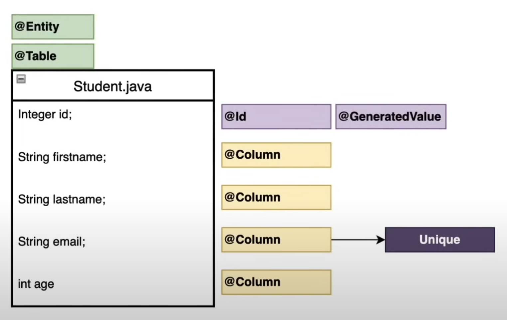
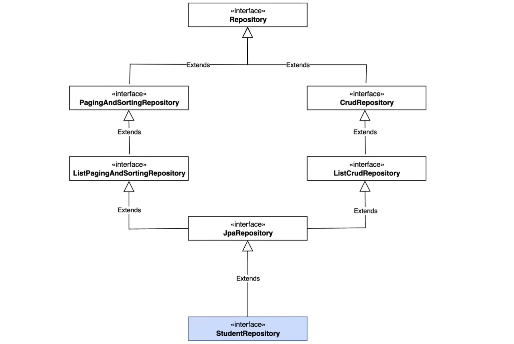
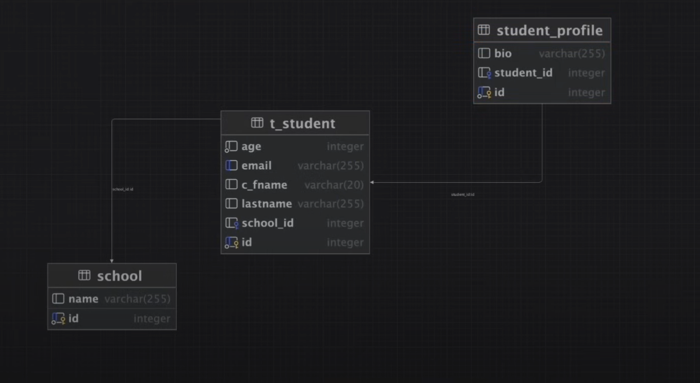
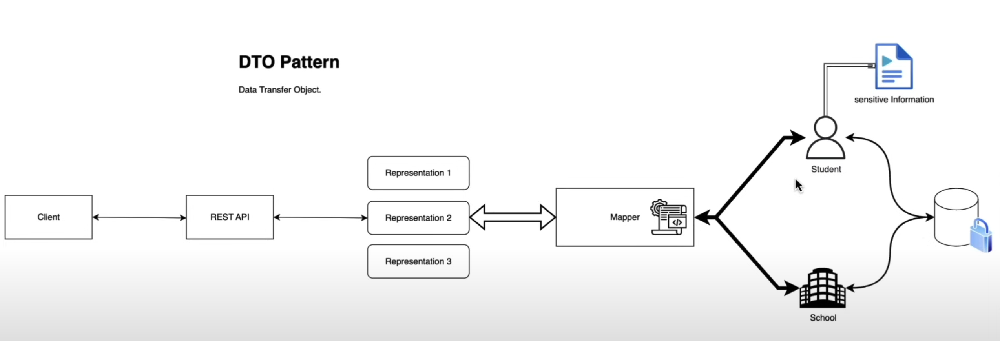
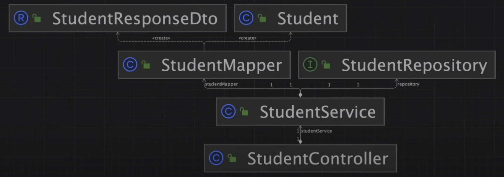
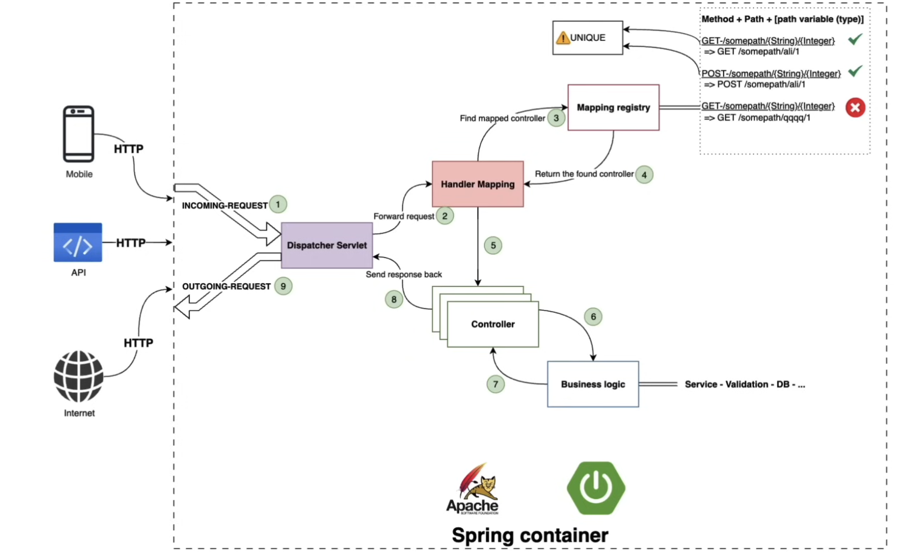

# Student Profile Management System

## Overview
Student Profile Management System is a web application which can be used to manage student profiles.

#### - Transform java class into entity which will be persistent entity in database

#### - JpaRepository hierarchy

#### - Implemented mapping between different entities

#### - Software design pattern

#### - Implementation of different classes

#### - Request dispatching workflow in spring boot

## Technologies Used
- Spring Boot
- Spring Data JPA
- Spring Validation
- PostgreSQL
- Git & GitHub